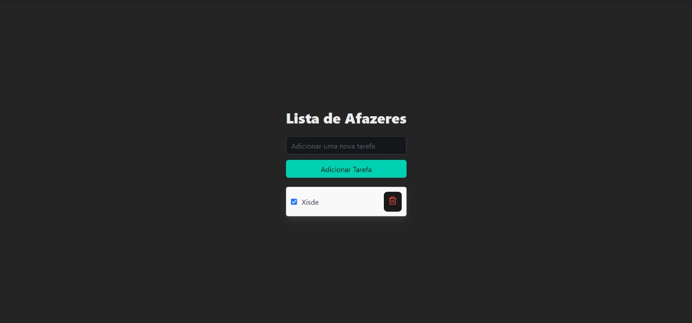

# To-Do List - Backend e Frontend

Este projeto é uma aplicação completa de To-Do List com backend em Node.js/TypeScript e frontend em Vite/React.

Foto do projeto realizado:


## Tecnologias Utilizadas
- **Backend:** Node.js, TypeScript, Express, dotenv
- **Frontend:** Vite, React, TypeScript, ESLint, Bulma, Lucide-react

## Estrutura do Projeto
```
.
|-- todolist-backend
|   |-- src
|   |   |-- db.ts
|   |   |-- index.ts
|   |-- package.json
|   |-- tsconfig.json
|   |-- .env
|
|-- todolist-frontend
|   |-- public
|   |-- src
|   |   |-- index.html
|   |-- package.json
|   |-- vite.config.ts
|   |-- tsconfig.json
|   |-- .env
```

## Dependências

### Frontend
- **React 19.0.0**
- **Bulma 1.0.3** (CSS framework)
- **Lucide-react 0.475.0** (Ícones)
- **Vite 6.1.0**
- **ESLint 9.19.0**, **Typescript 5.7.2**

### Backend
- **Express 4.21.2**
- **Cors 2.8.5**
- **Ts-node 10.9.2**, **Typescript 5.7.3**

## Configuração Inicial

### 1. Clone o repositório:
```bash
git clone https://github.com/seu-usuario/to-do-list-app.git
```

### 2. Instale as dependências:
```bash
cd todolist-backend
npm install
cd ../todolist-frontend
npm install
```

### 3. Configure os arquivos `.env`.

### 4. Rodar o projeto:
- **Backend:** `npm run dev`
- **Frontend:** `npm run dev`

## Contribuição
Pull requests são bem-vindos. Abra um issue para discutir mudanças maiores.

## Licença
[MIT](https://choosealicense.com/licenses/mit/)

